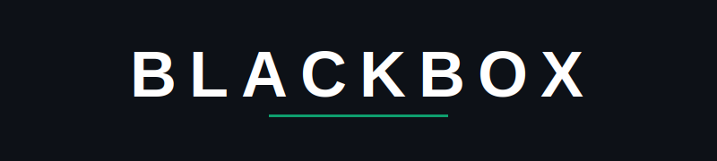

## BLACKBOX

 

 

> *This repository contains codes and implementations of various techniques under DSA.*

 

## Table of Contents

- [Introduction](#introduction)
- [Languages Used](#languages-used)
- [Topics](#topics)
- [Contribution Guidelines](#contribution-guidelines)

## Introduction

A collection of competitive programming techniques aimed at helping you learn and revise concepts.

## Languages Used

- Python
- C++
- C
- Go

## Topics

- Bit Manipulation
- Searching and Sorting
- Arrays
- Strings
- Trees
- Graphs
- Tries
- Dynamic Programming

## Contribution Guidelines

1. Fork the repo
2. Create a new branch
3. Commit changes
4. Push to your branch
5. Open a pull request

Please ensure to follow coding conventions and add comments.
---

Happy coding! 
